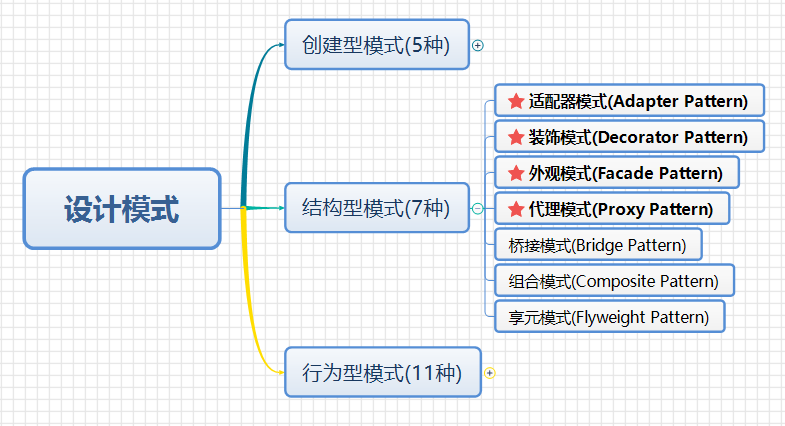

# 设计模式python实现(00)--初识

## 设计模式

- **设计模式**：对**软件设计**中普遍存在（反复出现）的各种问题，所提出解决方案。每一个设计模式系统地命名、解释和评价了面向对象系统一个重要的和重复出现的设计
- 《设计模式：可复用面向对象软件的基础》

## 接口

- 定义：若干个抽象方法的集合。
- 作用：限制实现接口的类必须按照接口给定的调用方式实现这些方法；对高层模块隐藏了类的内部实现。

## 面向对象好处

- **可维护**
- **可扩展**
- **可复用**
- **灵活性好**

## SOLID原则

**面向对象设计SOLID原则：**

- **开发封闭原则：**一个软件实体如类、模块和函数应该对扩展开放，对修改关闭。即软件实体应该尽量在不修改原有代码的情况下进行扩展。
- **里氏替换原则：**所有引用父类的地方必须能够透明地使用其子类的对象。也就是说子类必须能够替换掉它们父类型。
- **依赖倒置原则：**高层模块不应该依赖低层模块，二者都应该依赖其抽象；抽象不应该依赖细节；细节应该依赖抽象。换言之，要针对接口编程，而不是针对实现编程。
- **接口隔离原则：**使用多个专门的接口，而不是使用单一的接口，即客户端不应该依赖那些它不需要的接口。
- **单一职责原则：**不要存在多于一个导致类变更的原因。通俗的说，即一个类只负责一项职责。

**迪米特法则：**如果两个类不必彼此直接通信，那么这两个类就不应当发生直接的相互作用。如果其中一个类需要调用另一个类的某一个方法，可以通过第三者转发这个调用。迪米特法则根本思想，是强调了类之间的松耦合。类之间的耦合越弱，越有利于复用，一个处在弱耦合的类被修改，不会对有关系的类造成波及。

## 设计模式分类

