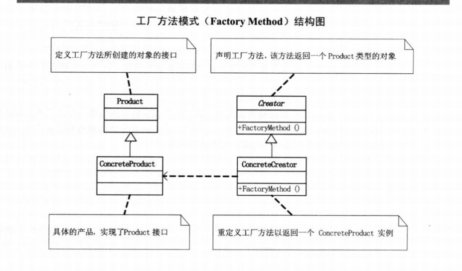

# 设计模式python实现(01)--工厂模式相关

## 简单工厂模式

- **内容：**不直接向客户端暴露对象创建的实现细节，而是通过一个工厂类来负责创建产品类的实例。
- **角色：**
  - 工厂角色（Creator）
  - 抽象产品角色（Product）
  - 具体产品角色（Concrete Product）

```python
"""
简单工厂模式
author: panky
"""
import abc  # 利用abc模块实现抽象类


class Operation(metaclass=abc.ABCMeta):
    def __init__(self, number_a, number_b):
        self._numberA = number_a
        self._numberB = number_b

    @abc.abstractmethod  # 定义抽象方法，无需实现功能, 由子类实现具体功能
    def get_result(self):
        pass


class OperationAdd(Operation):
    def get_result(self):
        return self._numberA + self._numberB


class OperationSub(Operation):
    def get_result(self):
        return self._numberA - self._numberB


class OperationMul(Operation):
    def get_result(self):
        return self._numberA * self._numberB


class OperationDiv(Operation):
    def get_result(self):
        try:
            return self._numberA / self._numberB
        except ZeroDivisionError:
            print("Divide by zero!")
            return 0


class OperationFactory(object):
    operation_map = {
        '+': OperationAdd,
        '-': OperationSub,
        '*': OperationMul,
        '/': OperationDiv
    }

    def creat_operation(self, op: str, num_a, num_b):
        operation_class = self.operation_map.get(op)
        if operation_class:
            operation = operation_class(num_a, num_b)
            return operation
        else:
            raise Exception("非法操作")


if __name__ == '__main__':
    while True:
        raw_str = input("输入算式：").strip()
        if raw_str == 'Q':
            break
        a, opr, b = raw_str.split(' ')
        factory = OperationFactory()
        opr_obj = factory.creat_operation(opr, int(a), int(b))
        res = opr_obj.get_result()
        print(res)
```


## 工厂方法模式

**工厂方法模式(Factory Method):**定义一个用于创建对象的接口，让子类去决定实例化哪一个类。工厂方法使一个类的实例化延迟到其子类。

### 工厂方法模式结构图




### 工厂方法模式案例

```python
"""
工厂方法模式
Author: panky
"""
import abc


class LeiFeng(metaclass=abc.ABCMeta):
    def sweep(self):
        print("扫地")

    def wash(self):
        print("洗衣")

    def buy_rice(self):
        print("买米")


# 学雷锋的大学生
class Undergraduate(LeiFeng):
    pass


# 学雷锋的志愿者
class Volunteer(LeiFeng):
    pass


# 雷锋工厂
class IFactory(metaclass=abc.ABCMeta):
    @abc.abstractmethod
    def create_lei_feng(self) -> LeiFeng:
        pass


# 学雷锋的大学生工厂
class UndergraduateFactory(IFactory):
    def create_lei_feng(self) -> LeiFeng:
        return Undergraduate()


class VolunteerFactory(IFactory):
    def create_lei_feng(self) -> LeiFeng:
        return Volunteer()


if __name__ == "__main__":
    factory = UndergraduateFactory()
    lf = factory.create_lei_feng()

    lf.buy_rice()
    lf.sweep()
    lf.wash()

    print('\n')
    factory = VolunteerFactory()
    lf2 = factory.create_lei_feng()
    lf2.wash()
    lf2.sweep()
    lf2.buy_rice()

```


## 抽象工厂模式

**抽象工厂模式：定义了一个接口，所有具体工厂必须实现此接口，该接口包含一组生成产品的方法。**

- **用途：** 将相关产品的制作加工等过程集合起来，用于创建产品的家族，而不需要关心具体产出的产品是什么。
- **优点：**易于实现多个产品的组合。


**工厂方法模式：定义了一个创建对象的接口，由子类负责实例化其中的类，即将实例化推迟到子类。**

- **用途：**用于单个产品的对象创建，抽象类型形成接口，供用户调用，子类负责具体的实例化。
- **优点：**将实现与使用解耦，该模式并不关心子类怎么实例化，所以子类的实例化也不会影响到接口。


**抽象工厂模式可以简单看作工厂方法模式的组合。**


下面用一个例子来说明抽象工厂模式：

- 有一个披萨店公司，它们有纽约和芝加哥分店，各分店披萨名字相同，但原料和口味会各不相同；
- 各分店的原料工厂负责为各自分店配送制作披萨的原料；
- 各分店根据客户需求负责披萨的制作及包装。

```python
from abc import abstractmethod


# 披萨原料基类
class PizzaIngredientFactory(object):
    @abstractmethod
    def choose_dough(self):
        pass

    @abstractmethod
    def choose_sauce(self):
        pass

    @abstractmethod
    def choose_cheese(self):
        pass

    @abstractmethod
    def choose_veggies(self):
        pass

    @abstractmethod
    def choose_clam(self):
        pass


class Dough(object):  # 披萨原料

    def __init__(self, name, shop_name):
        self._name = name
        self._shop_name = shop_name

    def dough_type(self):
        if self._shop_name == 'NY':
            return 'thick crust dough'
        elif self._shop_name == 'Chicago':
            return 'thin crust dough'
        else:
            print('There is no such store.')


class Sauce(object):  # 披萨原料

    def __init__(self, name, shop_name):
        self._name = name
        self._shop_name = shop_name

    def sauce_type(self):
        if self._shop_name == 'NY':
            return 'plum tomato sauce'
        elif self._shop_name == 'Chicago':
            return 'marinara sauce'
        else:
            print('There is no such store.')


class Clams(object):  # 披萨原料

    def __init__(self, name, shop_name):
        self._name = name
        self._shop_name = shop_name

    def clams_type(self):
        if self._shop_name == 'NY':
            return 'frozen clams'
        elif self._shop_name == 'Chicago':
            return 'fresh clams'
        else:
            print('There is no such store.')


class Cheese(object):  # 披萨原料

    def __init__(self, name, shop_name):
        self._name = name
        self._shop_name = shop_name

    def cheese_type(self):
        if self._shop_name == 'NY':
            return 'mozzarella cheese'
        elif self._shop_name == 'Chicago':
            return 'reggiano cheese'
        else:
            print('There is no such store.')


class NYPizzaIngredientFactory(PizzaIngredientFactory):  # 纽约的原料工厂
    def __init__(self, name):
        self._name = name

    def choose_dough(self):
        return Dough('choose_dough', 'NY').dough_type()

    def choose_sauce(self):
        return Sauce('choose_sauce', 'NY').sauce_type()

    def choose_veggies(self):
        veggies = ['garlic', 'onion', 'mushroom']
        return veggies

    def choose_cheese(self):
        return Cheese('choose_cheese', 'NY').cheese_type()

    def choose_clam(self):
        return Clams('choose_clams', 'NY').clams_type()


class ChicagoPizzaIngredientFactory(PizzaIngredientFactory):  # 芝加哥的原料工厂
    def __init__(self, name):
        self._name = name

    def choose_dough(self):
        return Dough('choose_dough', 'Chicago').dough_type()

    def choose_sauce(self):
        return Sauce('choose_sauce', 'Chicago').sauce_type()

    def choose_veggies(self):
        veggies = ['garlic', 'onion', 'mushroom']
        return veggies

    def choose_cheese(self):
        return Cheese('choose_cheese', 'Chicago').cheese_type()

    def choose_clam(self):
        return Clams('choose_clams', 'Chicago').clams_type()


class Pizza(object):  # 披萨基类，获取工厂原料
    @abstractmethod
    def require_ingredient(self):
        pass


class PizzaShop(object):  # 披萨店基类
    @abstractmethod
    def create_pizza(self):
        pass


class PreparePizza(object):  # 披萨准备类
    def bake(self):
        print('Bake for 25min at 350')

    def cut(self):
        print('cutting the pizza into diagonal slices')

    def box(self):
        print('place pizza in official pizza store box')


class CheesePizza(Pizza):  # 芝士披萨

    def __init__(self, name, shop_name):
        self._name = name
        self._shop_name = shop_name

    def require_ingredient(self):
        if self._shop_name == 'NY':
            return NYPizzaIngredientFactory('NY_shop').choose_cheese()
        elif self._shop_name == 'Chicago':
            return ChicagoPizzaIngredientFactory('Chicago_shop').choose_cheese()
        else:
            print('There is no such store.')


class ClamPizza(Pizza):  # 蛤蜊披萨

    def __init__(self, name, shop_name):
        self._name = name
        self._shop_name = shop_name

    def require_ingredient(self):
        if self._shop_name == 'NY':
            return NYPizzaIngredientFactory('NY_shop').choose_clam()
        elif self._shop_name == 'Chicago':
            return ChicagoPizzaIngredientFactory('Chicago_shop').choose_clam()
        else:
            print('There is no such store.')


class NYPizzaStore(PizzaShop):  # 纽约店，披萨在这里制作

    def __init__(self, pizza_name, pizza_shop='NY'):
        self._pizza_shop = pizza_shop
        self._pizza_name = pizza_name

    def create_pizza(self):
        pizza = None
        if self._pizza_name == 'Cheese':
            pizza = CheesePizza('cheese_pizza', self._pizza_shop).require_ingredient()
        elif self._pizza_name == 'Clam':
            pizza = ClamPizza('clam_pizza', self._pizza_shop).require_ingredient()
        PreparePizza().bake()
        PreparePizza().cut()
        PreparePizza().box()
        marked_words = f'the {pizza} pizza is ready'
        return marked_words


# 在纽约披萨店点了份芝士披萨
if __name__ == '__main__':
    cheese_pizza = NYPizzaStore('Cheese').create_pizza()
    print(cheese_pizza)

```


