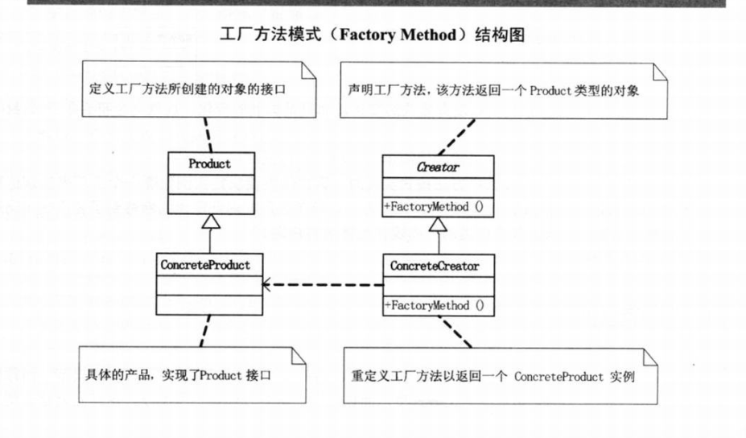

# 设计模式python实现(05)--工厂方法模式

**工厂方法模式(Factory Method):**定义一个用于创建对象的接口，让子类去决定实例化哪一个类。工厂方法使一个类的实例化延迟到其子类。

## 实现工厂方法模式




## 工厂方法模式案例

```python
"""
工厂方法模式
Author: panky
"""
import abc


class LeiFeng(metaclass=abc.ABCMeta):
    def sweep(self):
        print("扫地")

    def wash(self):
        print("洗衣")

    def buy_rice(self):
        print("买米")


# 学雷锋的大学生
class Undergraduate(LeiFeng):
    pass


# 学雷锋的志愿者
class Volunteer(LeiFeng):
    pass


# 雷锋工厂
class IFactory(metaclass=abc.ABCMeta):
    @abc.abstractmethod
    def create_lei_feng(self) -> LeiFeng:
        pass


# 学雷锋的大学生工厂
class UndergraduateFactory(IFactory):
    def create_lei_feng(self) -> LeiFeng:
        return Undergraduate()


class VolunteerFactory(IFactory):
    def create_lei_feng(self) -> LeiFeng:
        return Volunteer()


if __name__ == "__main__":
    factory = UndergraduateFactory()
    lf = factory.create_lei_feng()

    lf.buy_rice()
    lf.sweep()
    lf.wash()

    print('\n')
    factory = VolunteerFactory()
    lf2 = factory.create_lei_feng()
    lf2.wash()
    lf2.sweep()
    lf2.buy_rice()

```

