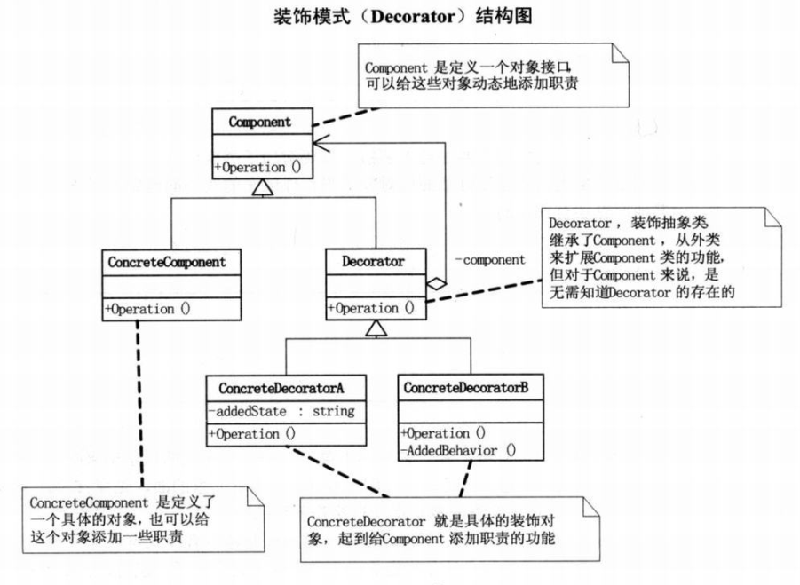
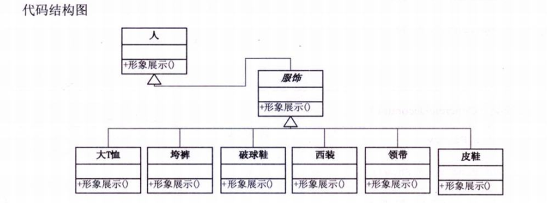

# 设计模式python实现(03)--装饰模式

**装饰模式(Decorator)：**动态地给一个对象添加一些额外的职责，就增加功能来说，装饰模式比生成子类更灵活。


## 装饰模式实现



```python
"""
装饰模式
author: panky
装饰模式是利用 set_component() 来对对象进行包装的，这样每个装饰对象的实现就和
如何使用这个对象分离开了，每个装饰对象只关心自己的功能，不需要关心如何被添加到
对象链中。
"""
import abc


class Component(metaclass=abc.ABCMeta):
    @abc.abstractmethod
    def operation(self):
        pass


class ConcreteComponent(Component):
    def operation(self):
        print("具体对象的操作！")


class Decorator(Component, metaclass=abc.ABCMeta):
    def __init__(self, component: Component = None):
        self.component = component

    def set_component(self, component: Component):
        """
        设置 Component，
        利用 set_component() 来对对象进行包装的
        :param component:
        :return:
        """
        self.component = component

    def operation(self):
        """
        重写 operation() ，实际执行的是 Component 的 operation()
        :return:
        """
        if self.component is not None:
            self.component.operation()


class ConcreteDecoratorA(Decorator):
    def __init__(self, added_state: str = None):
        super().__init__()
        self.added_state = added_state  # 本类对象独有属性

    def operation(self):
        """
        首先运行原 Component 的 operation(), 再执行本类的功能，如对 added_state 赋值，相当于
        对原来的 Component 进行了装饰
        :return:
        """
        super().operation()
        self.added_state = "New State"
        print("具体装饰对象A的操作")


class ConcreteDecoratorB(Decorator):
    @staticmethod
    def added_behavior():  # 本类独有方法
        print("具体装饰对象B增加方法 added_behavior")

    def operation(self):
        """
        首先运行原 Component 的 operation(), 再执行本类的功能，如执行 added_behavior() 方法，相当于
        对原来的 Component 进行了装饰
        :return:
        """
        super().operation()
        self.added_behavior()
        print("具体装饰对象B的操作")


if __name__ == "__main__":
    c = ConcreteComponent()
    d1 = ConcreteDecoratorA()
    d2 = ConcreteDecoratorB()

    d1.set_component(c)
    d1.operation()
    print("+-+-+-+-+-+-+-+-+-+-+-+-+-+-+-+-")
    d2.set_component(d1)
    d2.operation()
```


## 装饰模式案例



```python
"""
装饰模式--应用
author: panky
"""
import abc


# Person类(ConcreteComponent)
class Person:
    def __init__(self, name: str = None):
        self.name = name

    def show(self):
        print(f"\033[32m装扮的{self.name}\033[0m!")


# 服饰类(Decorator)
class Finery(Person, metaclass=abc.ABCMeta):
    def __init__(self, component: Person = None):
        super().__init__()
        self.component = component

    def decorate(self, component):
        self.component = component

    @abc.abstractmethod
    def show(self):
        if self.component is not None:
            self.component.show()


# 具体服饰类(ConcreteDecorator)
class TShirts(Finery):
    def show(self):
        print("TShirts")
        super().show()


class BigTrouser(Finery):
    def show(self):
        print("垮裤")
        super().show()


class Tie(Finery):
    def show(self):
        print("领带")
        super().show()


class Suit(Finery):
    def show(self):
        print("西装")
        super().show()


class LeatherShoes(Finery):
    def show(self):
        print("皮鞋")
        super().show()


class Sneakers(Finery):
    def show(self):
        print("运动鞋")
        super().show()


if __name__ == "__main__":
    p1 = Person("suki")
    print("\n第一种装扮：")
    t = TShirts()
    b = BigTrouser()
    ls = LeatherShoes()

    # 装饰过程
    t.decorate(p1)
    b.decorate(t)
    ls.decorate(b)
    ls.show()

    print("\n第二种装扮：")
    px = LeatherShoes()
    ld = Tie()
    xz = Suit()

    # 装扮过程
    px.decorate(p1)
    ld.decorate(px)
    xz.decorate(ld)
    xz.show()
```


## 装饰模式总结

- 装饰模式是为已有功能动态地添加更多功能的一种方式。
- 当系统需要新功能的时候，是向旧的类中添加新代码。这些新加的代码通常装饰了原有类的核心职责或者主要行为，在主类中加入了新的字段，新的方法和新的逻辑，从而增加了主类的复杂度，而这些新加入的东西仅仅是为了满足一些只在某种特定情况下才会执行的特殊行为的需要。而**装饰模式**却提供了一个非常好的解决方案，**它把每个要装饰的功能放在单独的类中，并让这个类包装它所要装饰的对象**，因此，<mark>当需要执行特殊行为时，客户代码就可以在运行时根据需要有选择地，按顺序地使用装饰功能包装对象了。</mark>
- 装饰模式的优点：
  - 把类中的装饰功能从类中搬移去除，可以简化原有的类
  - 有效地把类地核心职责和装饰功能区分开了。而且可以去除相关类中重复地装饰逻辑。


