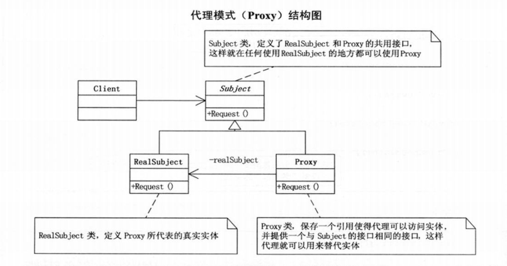

# 设计模式python实现(04)--代理模式

**代理模式(Proxy):**为其他对象提供一种代理以控制对这个对象的访问。


## 代理模式实现



```python
"""
代理模式
author: panky
"""
import abc


# Subject 类，定义了 RealSubject 和 Proxy 的共用接口
class Subject(metaclass=abc.ABCMeta):
    @abc.abstractmethod
    def request(self):
        pass


# RealSubject 类，定义了 Proxy 所代表的真实实体
class RealSubject(Subject):
    def request(self):
        print("真实的请求", self)


# Proxy类，保存一个引用使得代理可以访问实体，并提供一个与 Subject 的接口相同的接口，这样代理可以用来代替实体
class Proxy(Subject):
    def __init__(self, real_subject: RealSubject = None):
        self.real_subject = real_subject

    def request(self):
        if self.real_subject is None:
            self.real_subject = RealSubject()

        self.real_subject.request()

    def reset_real_subject(self, real_subject: RealSubject):
        self.real_subject = real_subject


if __name__ == "__main__":
    proxy = Proxy()
    proxy.request()

    aa = RealSubject()
    proxy.reset_real_subject(aa)
    proxy.request()
```


## 代理模式案例


```python
"""
代理模式
author: panky
"""
import abc


class GiveGift(metaclass=abc.ABCMeta):
    @abc.abstractmethod
    def give_dolls(self):
        pass

    @abc.abstractmethod
    def give_flowers(self):
        pass

    @abc.abstractmethod
    def give_chocolate(self):
        pass


class SchoolGirl:
    def __init__(self, name):
        self.name = name


class Pursuit(GiveGift):
    def __init__(self, mm: SchoolGirl):
        self.mm = mm

    def give_dolls(self):
        print(self.mm.name, "送你洋娃娃")

    def give_flowers(self):
        print(self.mm.name, "送你鲜花")

    def give_chocolate(self):
        print(self.mm.name, "送你巧克力")


class Proxy(GiveGift):
    def __init__(self, mm: SchoolGirl):
        self.gg = Pursuit(mm)

    def give_dolls(self):
        self.gg.give_dolls()

    def give_flowers(self):
        self.gg.give_flowers()

    def give_chocolate(self):
        self.gg.give_chocolate()


if __name__ == "__main__":
    jiao_jiao = SchoolGirl("Li jiao jiao")

    proxy = Proxy(jiao_jiao)
    proxy.give_flowers()
    proxy.give_dolls()
    proxy.give_chocolate()
```


## 代理模式总结

- **远程代理：**为一个对象在不同的地址空间提供局部代表。这样可以隐藏一个对象存在于不同地址空间的事实。
- **虚拟代理：**根据需要创建开销很大的对象。通过它来存放实例化需要很长时间的真实对象。
- **安全代理：**用来控制真实对象访问时的权限。
- **智能指引：**是指调用真实的对象时，代理处理另外一些事。


