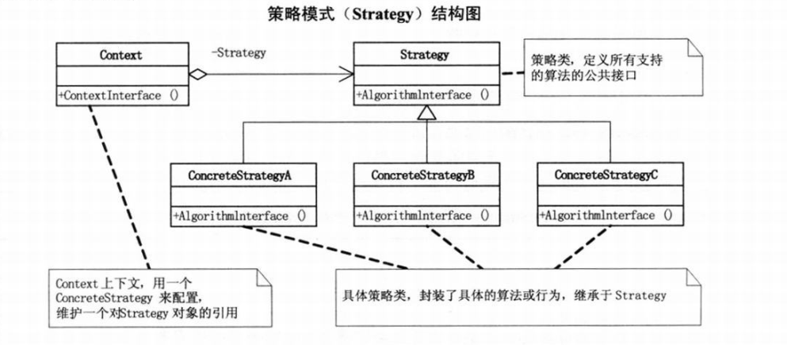
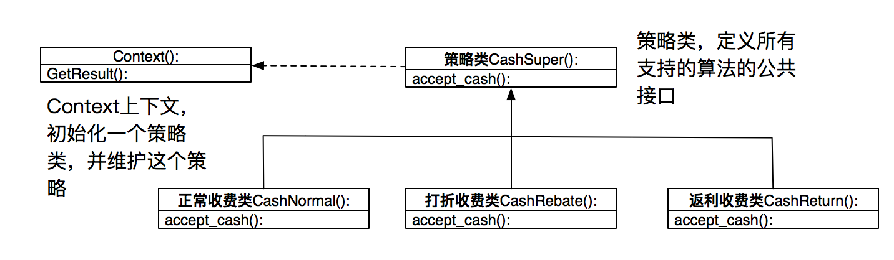

# 设计模式python实现(02)--策略模式

**策略模式：**定义了算法家族，分别封装起来，让它们之间可以互相替换，此模式让算法的变化，不会影响到使用算法的客户。<mark>面对算法时常变动</mark>

## 策略模式实现



```python
"""
策略模式
author: panky
"""
import abc


# 抽象算法类
class Strategy(metaclass=abc.ABCMeta):
    @abc.abstractmethod
    def algorithm_interface(self):
        pass


# 具体算法 A
class ConcreteStrategyA(Strategy):
    def algorithm_interface(self):
        print("算法 A 实现")


# 具体算法 A
class ConcreteStrategyB(Strategy):
    def algorithm_interface(self):
        print("算法 B 实现")


# 具体算法 C
class ConcreteStrategyC(Strategy):
    def algorithm_interface(self):
        print("算法 C 实现")


class Context:
    def __init__(self, strategy: Strategy):  # 初始化时，传入具体的策略对象
        self.strategy = strategy

    def context_interface(self):  # 根据具体的策略对象，调用其算法方法
        self.strategy.algorithm_interface()


if __name__ == "__main__":
    context = Context(ConcreteStrategyA())
    context.context_interface()

    context = Context(ConcreteStrategyB())
    context.context_interface()

    context = Context(ConcreteStrategyC())
    context.context_interface()

```


## 策略模式案例



```python
"""
策略模式--应用
author: panky
"""
import abc


class CashSuper(metaclass=abc.ABCMeta):
    """现金收费抽象类"""

    @abc.abstractmethod
    def accept_cash(self, money):
        pass


class CashNormal(CashSuper):
    """正常收费子类"""
    def accept_cash(self, money):
        return money


class CashRebate(CashSuper):
    """打折收费子类"""
    def __init__(self, discount=1.0):
        self.discount = discount

    def accept_cash(self, money):
        return money * self.discount


class CashReturn(CashSuper):
    """返利收费子类"""

    def __init__(self, money_condition=0, money_return=0):
        self.money_condition = money_condition
        self.money_return = money_return

    def accept_cash(self, money):
        if money >= self.money_condition:
            return money - (money / self.money_condition) * self.money_return
        return money


class Context(object):
    """具体策略类"""
    def __init__(self, c_super: CashSuper):
        self.c_super = c_super

    def get_result(self, money):
        return self.c_super.accept_cash(money)


if __name__ == "__main__":
    input_money = input("原价：")
    strategy = dict()
    strategy[1] = Context(CashNormal())
    strategy[2] = Context(CashRebate(0.8))
    strategy[3] = Context(CashReturn(100, 10))
    mode = input("选择折扣方式： 1）原价 2）8折 3）满100减10：")
    if int(mode) in strategy:
        c_s = strategy[int(mode)]
    else:
        print("不存在的折扣方式")
        c_s = strategy[1]
    print("pay: ", c_s.get_result(float(input_money)))
```

使用一个策略类`CashSuper`定义需要的算法的公共接口，定义三个具体策略类：`CashNormal`,`CashRebate`,`CashReturn`，继承于`CashSuper`,定义一个上下文管理类，接收一个策略，并根据该策略得出结论，当需要更改策略时，只需要在实例的时候传入不同的策略就可以，免去了修改类的麻烦