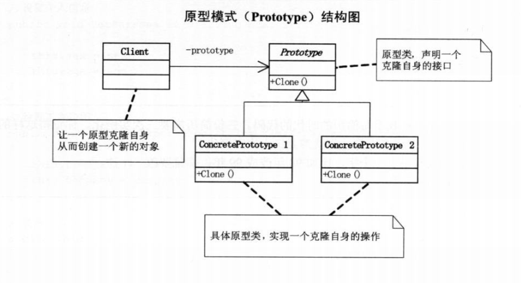
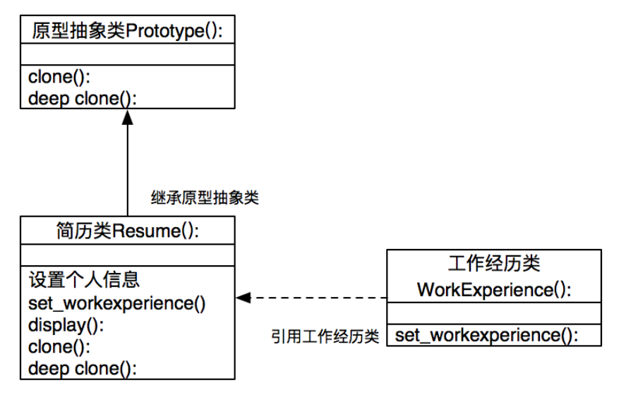

# 设计模式python实现(06)--原型模式

## 什么是原型模式

如果**对象的创建成本比较大**，而同一个类的不同对象之间差别不大（大部分字段都相同），在这种情况下，我们可以利用对已有对象（原型）进行复制（或者叫拷贝、克隆）的方式，来创建新对象，以达到节省创建时间的目的。这种**基于原型来创建对象的方式就叫作原型设计模式，简称原型模式**。

**核心：拷贝（克隆）**<mark>克隆不会创建实例，所有可以节省创建实例或实例化的开销</mark>


## 应用场景

创建对象包含的申请内存、给成员变量赋值这一过程，本身并不会花费太多时间，对于大部分业务系统来说，这点时间完全是可以忽略的。

但是，如果对象中的数据**需要经过复杂的计算才能得到**（比如排序、计算哈希值），或者**需要从 RPC、网络、数据库、文件系统等非常慢速的 IO 中读取**，这种情况下，我们就可以利用原型模式，从其他已有对象中直接拷贝得到，而不用每次在创建新对象的时候，都重复执行这些耗时的操作。


## 原型模式实现



```python
"""
*What is this pattern about?
This patterns aims to reduce the number of classes required by an
application. Instead of relying on subclasses it creates objects by
copying a prototypical instance at run-time.

This is useful as it makes it easier to derive new kinds of objects,
when instances of the class have only a few different combinations of
state, and when instantiation is expensive.

*What does this example do?
When the number of prototypes in an application can vary, it can be
useful to keep a Dispatcher (aka, Registry or Manager). This allows
clients to query the Dispatcher for a prototype before cloning a new
instance.

Below provides an example of such Dispatcher, which contains three
copies of the prototype: 'default', 'objecta' and 'objectb'.

*TL;DR
Creates new object instances by cloning prototype.
"""


class Prototype:

    value = "default"

    def clone(self, **attrs):
        """Clone a prototype and update inner attributes dictionary"""
        obj = self.__class__()
        obj.__dict__.update(attrs)
        return obj


class PrototypeDispatcher:
    def __init__(self):
        self._objects = {}

    def get_objects(self):
        """Get all objects"""
        return self._objects

    def register_object(self, name, obj):
        """Register an object"""
        self._objects[name] = obj

    def unregister_object(self, name):
        """Unregister an object"""
        del self._objects[name]


if __name__ == "__main__":
    dispatcher = PrototypeDispatcher()
    prototype = Prototype()

    d = prototype.clone()
    a = prototype.clone(value='a-value', category='a')
    b = prototype.clone(value='b-value', is_checked=True)

    dispatcher.register_object('object_a', a)
    dispatcher.register_object('object_b', b)
    dispatcher.register_object('default', d)

    print([{n: p.value} for n, p in dispatcher.get_objects().items()])
```


## 原型模式案例

**原型模式是用场景**:需要大量的基于某个基础原型进行微量修改而得到新原型时使用



```python
import abc
from copy import copy, deepcopy


class Prototype(metaclass=abc.ABCMeta):
    @abc.abstractmethod
    def clone(self):
        pass

    @abc.abstractmethod
    def deep_clone(self):
        pass


# 工作经历类
class WorkExperience(object):
    def __init__(self):
        self._time_area = ''
        self._company = ''

    def set_work_experience(self, time_area, company):
        self._time_area = time_area
        self._company = company

    @property
    def time_area(self):
        return self._time_area

    @property
    def company(self):
        return self._company


# 简历类
class Resume(Prototype):
    def __init__(self, name):
        self._name = name
        self._sex = None
        self._age = None
        self._work_experience = WorkExperience()

    def set_person_info(self, sex: str, age: int):
        self._sex = sex
        self._age = age

    def set_work_experience(self, time_area: str, company: str):
        self._work_experience.set_work_experience(time_area, company)

    def display(self):
        print(self._name)
        print(self._sex, self._age)
        print('工作经历：', self._work_experience.time_area, self._work_experience.company)

    def clone(self):
        return copy(self)

    def deep_clone(self):
        return deepcopy(self)


if __name__ == '__main__':
    obj1 = Resume('panky')
    obj2 = obj1.clone()
    obj3 = obj1.deep_clone()

    print(obj1, obj2, obj3)

    obj1.set_person_info('man', 27)
    obj1.set_work_experience('2016-2020', 'GZ')

    obj2.set_person_info('man', 28)
    obj2.set_work_experience('2017-2018', 'HM')

    obj3.set_person_info('man', 29)
    obj3.set_work_experience('2020-2021', 'HW')

    obj1.display()
    obj2.display()
    obj3.display()
```

